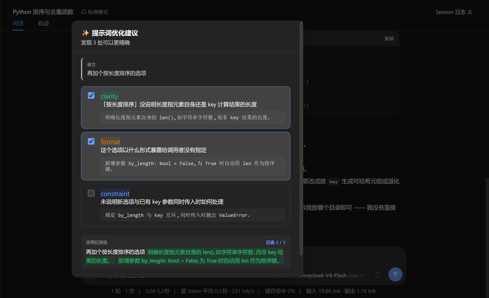

# dsh-prompt-refine

[](LICENSE)

DSH 提示词优化插件 —— 在发送前点一下,让模型结合上下文告诉你这条 prompt 缺什么。



## 它做什么

在输入框发送按钮**左侧**加一个 ✨ 按钮。点击后:

1. 读当前草稿 + 最近几条对话历史
2. 调你已配置好的模型(自动读 `~/.dsh/settings.yaml` 的 `agent-default-model`)
3. 弹窗列出 **3 条「问题 + 补丁」** 形式的建议
4. 勾选想要的 → 实时预览合并后的 prompt
5. 点「采纳 N 条并填入」→ 新 prompt 写回输入框

**不抢你的发送权**:填好后你自己按发送。Esc / 点遮罩 / 「跳过」都能随时退出。

## 为什么是「补丁」而不是「重写」

建议保留你原话,只补缺口:

```
原文    写个排序

scope     未说明排序对象 → 对一组整数数组进行升序排序。
format    未指定语言签名 → 请用 Python 实现,函数签名 sort_list(nums)。
constraint 缺边界约束     → 要求 O(n log n),处理空数组与重复元素。
```

三条可以同时采纳,不用三选一。

## 安装

### 方式一：npm 安装（推荐）

```bash
cd ~/.dsh/profiles/web    # 换成你要装进去的 profile
pnpm add dsh-prompt-refine
```

包内自带 `dsh.bundle.patch` 声明，安装后把 `dsh-prompt-refine` 加进该 profile `package.json` 的 `dsh.profile.bundles` 数组即可激活，然后重启 DSH。

### 方式二：源码安装（开发用）

```bash
pnpm install
pnpm build

# 装进 web profile
node scripts/install.mjs --profile web
rm -rf ~/.dsh/profiles/web/node_modules/dsh-prompt-refine
(cd ~/.dsh/profiles/web && pnpm install --force)
```

## 运行(开发模式)

```bash
# 在 deepseek-harness 仓库根目录
pnpm dsh web --patch ./dsh-prompt-refine/cordis.yml --no-open --port 0
```

或者用附带的脚本(自动杀旧实例 + 重启 + 打印新 URL):

```bash
bash scripts/dev-restart.sh
```

## 模型配置

**v0.1 无需配置** —— 自动读用户 settings.yaml 里的 `agent-default-model`,
跟随你平时用的模型。改模型只改那里。

v0.2 计划:插件自己的设置页,可单独指定"优化用的模型"(比如用便宜的快模型)。

## 文件结构

```
src/
  dsh-prompt-refine.ts   host 入口
  host.ts                HTTP 端点 + ctx.llm 调用 + 降级
  shared/types.ts        请求/响应形状
  shared/prompt.ts       system prompt + JSON 解析
  client.ts              ✨ 按钮 + Portal 弹窗
scripts/
  install.mjs            装进 profile
```

## License

MIT
